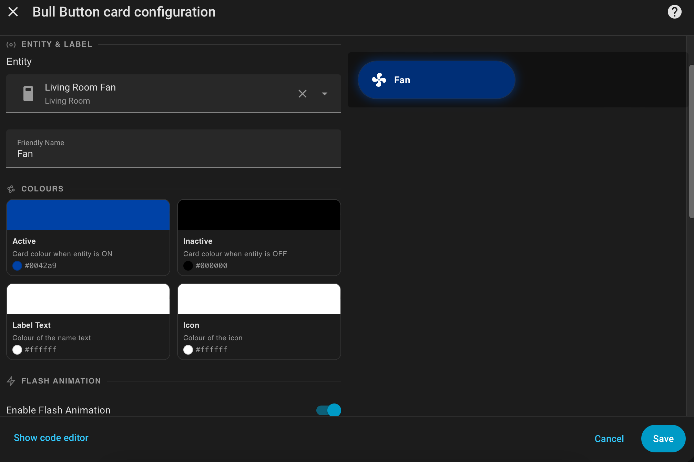

# 🐂 Bull Button Card

[](https://my.home-assistant.io/redirect/hacs_repository/?owner=jamesmcginnis&repository=bull-button-card&category=plugin)


A pill-shaped, entity-driven button card for [Home Assistant](https://www.home-assistant.io/) with flash animation, custom colours, SVG icon support, and a fully featured visual editor.

---

## ✨ Features

- **Pill-shaped design** — a sleek, modern button that blends seamlessly with other cards in your dashboard
- **Flash animation** — the card flashes a customisable colour when the bound entity turns **on**, and returns to a different customisable colour when **off**
- **Fully customisable colours** — pick colours for the active state, inactive state, name text, and icon independently
- **Home Assistant icon picker** — choose any built-in MDI icon from HA's native icon browser to display on the left side of the card
- **Text alignment** — choose left, centre, or right alignment for the label
- **Friendly name** — set a human-readable label independent of the entity ID
- **Visual editor** — every option is configurable through Home Assistant's built-in card editor — no YAML required
- **Adjustable flash speed** — fine-tune how fast the card flashes when active
- **Works with any toggleable entity** — switches, lights, input booleans, and more

---

## 📸 Preview




---

## 🚀 Installation

### Via HACS (Recommended)

[](https://my.home-assistant.io/redirect/hacs_repository/?owner=jamesmcginnis&repository=bull-button-card&category=plugin)

1. Click the button above, **or** open HACS in your Home Assistant instance and search for **Bull Button Card**
2. Click **Download**
3. Restart Home Assistant
4. Add the card to your dashboard using the card picker

### Manual Installation

1. Download `bull-button-card.js` from the [latest release](https://github.com/jamesmcginnis/bull-button-card/releases/latest)
2. Copy it to your `/config/www/` folder (create the folder if it doesn't exist)
3. Go to **Settings → Dashboards → Resources**
4. Add a new resource:
   - **URL:** `/local/bull-button-card.js`
   - **Resource type:** JavaScript Module
5. Reload your browser
6. Add the card to your dashboard

---

## ⚙️ Configuration

All options are available in the **visual editor**. Click **Edit → Add Card → Bull Button Card** to get started.

### Options

| Option | Type | Default | Description |
|---|---|---|---|
| `entity` | `string` | **required** | The entity to bind (e.g. `switch.living_room`) |
| `name` | `string` | entity name | Friendly display name shown on the card |
| `active_color` | `string` | `#ff3b3b` | Background colour when entity is **on** |
| `inactive_color` | `string` | `#2c2c2e` | Background colour when entity is **off** |
| `name_color` | `string` | `#ffffff` | Colour of the label text |
| `icon_color` | `string` | `#ffffff` | Colour applied to the SVG / image icon |
| `flash_enabled` | `boolean` | `true` | Enable or disable flash animation when **on** |
| `flash_speed` | `number` | `600` | Flash interval in milliseconds |
| `show_icon` | `boolean` | `false` | Show an icon on the left of the card |
| `icon` | `string` | `""` | Any HA built-in MDI icon (e.g. `mdi:lightbulb`) — chosen via the visual editor's icon picker |
| `text_align` | `string` | `center` | Text alignment: `left`, `center`, or `right` |
| `font_size` | `string` | `14px` | Font size of the label |
| `card_height` | `string` | `54px` | Height of the pill card |

### Example YAML

```yaml
type: bull-button-card
entity: switch.living_room_light
name: Living Room Light
active_color: "#ff3b3b"
inactive_color: "#2c2c2e"
name_color: "#ffffff"
icon_color: "#ffffff"
flash_enabled: true
flash_speed: 600
show_icon: true
icon: mdi:lightbulb
text_align: center
font_size: 14px
card_height: 54px
```

---

## 📄 License

Distributed under the MIT License. See [`LICENSE`](LICENSE) for more information.

---

## 🙏 Acknowledgements

- Built for the [Home Assistant](https://www.home-assistant.io/) community
